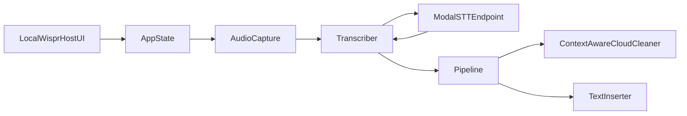

# LocalWispr Architecture

This document describes the current production flow in this repository.

---

## System Overview

---

## Core engineering rule

- Prefer parallelization, batching, pipelining, and concurrency whenever work is independent and correctness is preserved.
- Serialization should be treated as the exceptional case and should be justified by correctness, ordering, or external rate-limit constraints.
- This rule applies to app latency work, Modal backend work, evaluation scripts, and research workflows in `tools/`.

---

## Runtime Entry

- `AppHost/LocalWisprHost/App.swift` starts the menu-bar app and control panel host window.
- `AppState.shared.bootstrap()` initializes hotkeys, permissions, history, and model prep state.
- Dictation orchestration and state transitions are centralized in `AppState`.

---

## Dictation Lifecycle

### Start

1. User triggers `toggleDictation()`.
2. `AppState` validates permissions.
3. `Transcriber.startSession(...)` creates a **buffered session**.
4. `AudioCapture` streams normalized 16k mono buffers to `session.append(...)`.

### Stop

1. `AudioCapture.stopAndDrain()` stops the mic and returns captured buffers.
2. `session.finish()` performs one STT request with full captured audio.
3. The transcript is fed into `Pipeline.process(...)`.
4. Cleanup and insertion complete, then history/latency stats are persisted.

There is no chunked live transcript path in this flow; transcript output is returned after stop.

---

## STT (Modal Whisper)

- STT client implementation lives in `Sources/LocalWispr/Transcriber.swift`.
- The app sends one multipart upload to a Modal endpoint per utterance.
- Expected endpoint shape: `POST /v1/audio/transcriptions` returning JSON with at least `text`.
- Required env vars:
  - `LOCALWISPR_MODAL_STT_ENDPOINT`
  - `LOCALWISPR_MODAL_STT_API_KEY`
- Optional env vars:
  - `LOCALWISPR_MODAL_STT_MODEL` (default `openai/whisper-large-v3-turbo`)
  - `LOCALWISPR_MODAL_STT_TIMEOUT_SECONDS` (default `60`)

`Transcriber` logs metrics to `/tmp/localwispr-debug.log` including:
- `audioSeconds`
- `uploadMs`
- `serverDecodeMs` (if returned by service payload)
- `textLength`

---

## Cleanup + Insertion Pipeline

- `Pipeline` runs:
  1. Transcript normalization.
  2. Cleanup via `Cleaning` implementation (`AdaptiveTextCleaner`/`ContextAwareCloudCleaner` path).
  3. Text insertion via `TextInserter`.
- `PipelineLatency` tracks:
  - stop-to-transcript
  - cleanup
  - insertion
  - total stop-to-insert

---

## UI and Persistence

- UI: `MenuBarView`, `ControlPanelView`, settings/history dashboards.
- Persistence:
  - `TranscriptHistoryStore` for transcript records.
  - `UserDefaults` for hotkeys and app preferences.

---

## Testing and Evaluation

- Unit/integration tests: `Tests/LocalWisprTests`.
- STT integration: `TranscriberIntegrationTests` with `LOCALWISPR_TRANSCRIBER_AUDIO`.
- Manual evaluation:
  - `ManualEvalTests.testModalSTTOnEvalSet()` compares transcript WER against references.
  - outputs include audio duration, stop-to-transcript timing, and transcript size.

---

## SLO

End-to-end latency target from stop action to final inserted text:

- p90 `< 1.0s`
- p99 `<= 1.5s`

---

## Related Docs

- `docs/MODAL-STT.md`
- `docs/ROADMAP.md`
